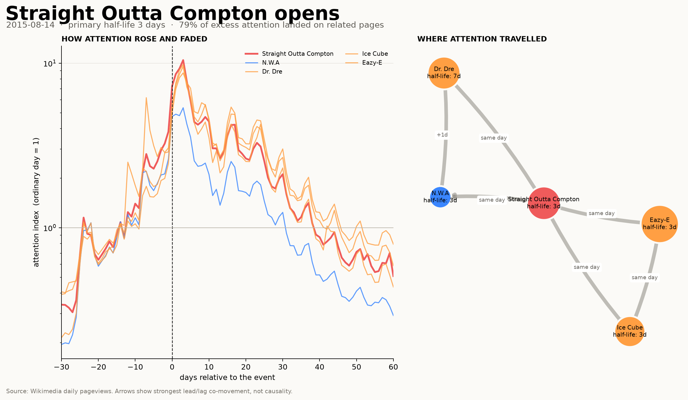
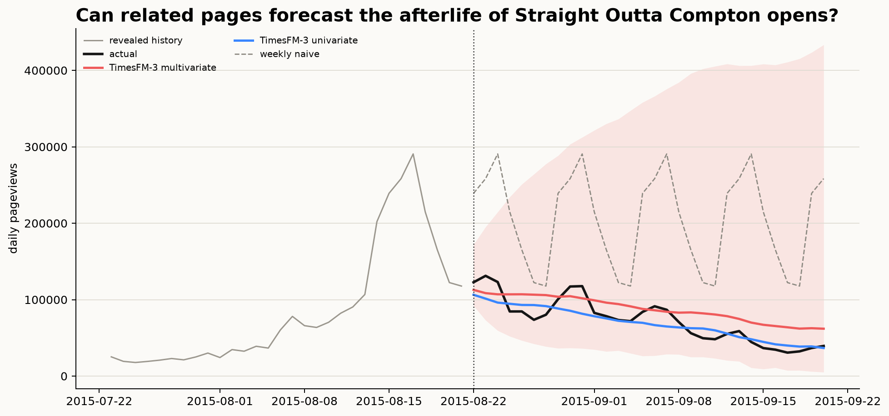

# Internet Half-Life

**How many days does it take the internet to forget something?**

Internet Half-Life is a small data atlas of cultural events as seen through
Wikipedia. It follows not only the obvious article, but the constellation around
it: people, places, works, institutions, and ideas. Then it measures where the
attention went, how long it stayed, and whether a multivariate forecaster could
see the decay coming.



## The idea

A cultural event rarely lives on one page. When *Barbie* and *Oppenheimer*
opened on the same day, readers also moved toward Margot Robbie, Cillian Murphy,
the real J. Robert Oppenheimer, and the Manhattan Project.

This repository turns each event into a small time-series universe:

```text
                   Margot Robbie
                        ●
                        │
Barbie ● ──────── Barbenheimer ──────── ● Oppenheimer
                        │                         │
                        ●                         ●
                   Cillian Murphy         Manhattan Project
```

For every page, it calculates:

- **Peak lift:** the peak divided by an ordinary pre-event day.
- **Attention half-life:** the first day after the peak when excess attention
  stays below half of the peak for three consecutive days.
- **First-week share:** how much of the 60-day excess arrived in week one.
- **Spillover:** the share of excess views that landed outside the event's
  primary article.
- **Lead/lag co-movement:** which related pages tended to move earlier or later.
  This is descriptive and is never presented as causality.

## The forecasting experiment

TimesFM-3 is natively multivariate. That gives the project a precise question:

> After revealing the first seven days of an event, do related pages help
> forecast the next thirty days of its attention?

The same window is forecast three ways:

1. TimesFM-3 with all related pages jointly.
2. TimesFM-3 with every page treated independently.
3. A weekly seasonal-naive baseline.

The comparison matters more than a single attractive forecast. If the
multivariate run does not beat the independent run, the surrounding
constellation was visually interesting but not useful predictive context.

### First result: Straight Outta Compton

The film opened on 14 August 2015. All five pages peaked three days later. The
primary article's attention half-life was three days, but Dr. Dre stayed above
half-peak excess for seven days. Across the first 60 days, the universe
received **13.1 million views above baseline**, and **79%** of them landed
outside the film's own page.

After revealing the first seven post-release days, the 30-day forecasting
scores were:

| model | WAPE ↓ | 10–90 interval coverage |
|---|---:|---:|
| TimesFM-3 multivariate | **0.248** | 1.000 |
| TimesFM-3 univariate | 0.251 | 0.993 |
| weekly naive | 1.514 | 0.000 |

The overall multivariate win is tiny and uneven. Related pages helped Dr. Dre
and Eazy-E, hurt the film and N.W.A, and barely changed Ice Cube. Co-movement
is therefore not automatically useful forecasting context—which is a more
interesting result than a universal win.



## Included event universes

```bash
internet-half-life list
```

- Straight Outta Compton's opening
- Barbenheimer
- ChatGPT's public launch
- James Webb's first images
- Ever Given blocking the Suez Canal
- The 2022 World Cup final
- Chandrayaan-3's lunar landing
- The first GTA VI trailer
- The 2024 total solar eclipse
- Inside Out 2's opening

The catalog is deliberately small and readable. Adding an event means adding
one dated entry and its related Wikipedia pages to
[`catalog/events.json`](catalog/events.json), not editing analysis code.

## Quick start

The atlas and the forecasting experiment are separate. You can reproduce the
data story without downloading any model weights.

```bash
make setup
make sample EVENT=straight-outta-compton
```

This downloads cached daily pageviews, calculates the metrics, and writes the
atlas to `figures/straight-outta-compton-atlas.png`.

To add TimesFM-3:

```bash
make setup-timesfm
make forecast EVENT=straight-outta-compton
```

Or use the CLI directly:

```bash
internet-half-life fetch --event barbenheimer
internet-half-life analyze --event barbenheimer
internet-half-life render --event barbenheimer
internet-half-life forecast --event barbenheimer --device mps
```

Raw API responses and page-level CSVs are cached locally. Delete `data/cache/`
only when you intentionally want to fetch again.

## Data and interpretation

Daily article traffic comes from the public
[Wikimedia Analytics API](https://doc.wikimedia.org/generated-data-platform/aqs/analytics-api/reference/page-views.html),
which provides per-page data from July 2015 onward. Requests use the `user`
agent class to exclude recognized automated traffic.

Pageviews are not people, approval, or sentiment. English Wikipedia is not
"the whole internet." Renames, redirects, news placement, search engines, and
bot detection can all change a series. The project therefore describes
**attention recorded by English Wikipedia**, not universal human interest.

TimesFM-3 source code and weights do not share the same terms. At the time this
project was written, the 3.0 pretrained weights were restricted to
non-commercial, non-production use. Read the
[official repository's license notice](https://github.com/google-research/timesfm#license-notice-for-pretrained-weights)
before running or publishing model-derived results.

## Project layout

```text
catalog/events.json                  curated event universes
src/internet_half_life/wikimedia.py cached pageview client
src/internet_half_life/metrics.py   half-life and spillover metrics
src/internet_half_life/forecasting.py TimesFM-3 and naive comparison
src/internet_half_life/visualize.py atlas and forecast figures
article/medium-tr.md                 Turkish article draft
tests/                               deterministic metric tests
```

The project is an experiment, not a claim that attention follows a universal
decay law. The interesting cases are often the ones that refuse to die cleanly.
