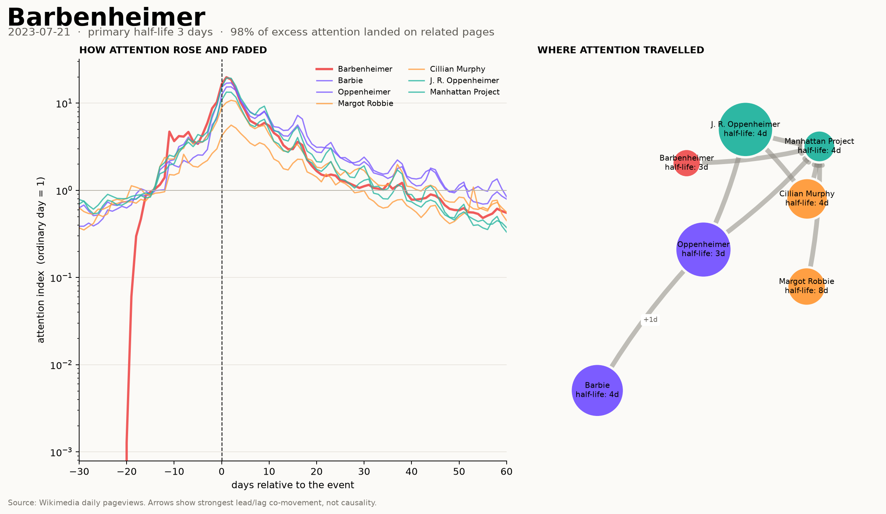
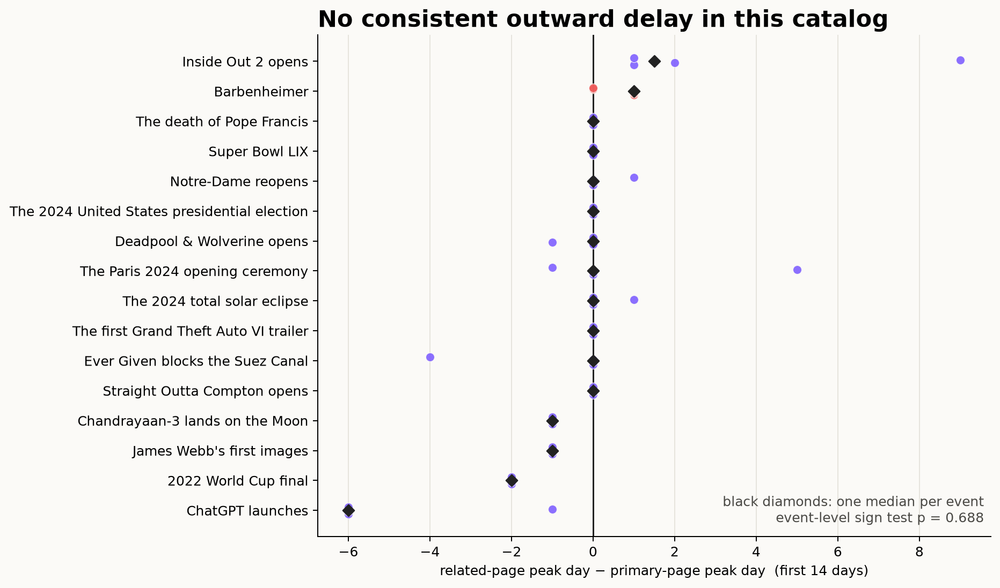
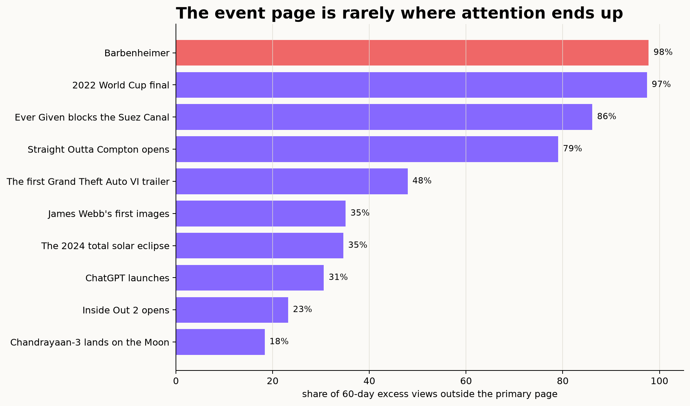
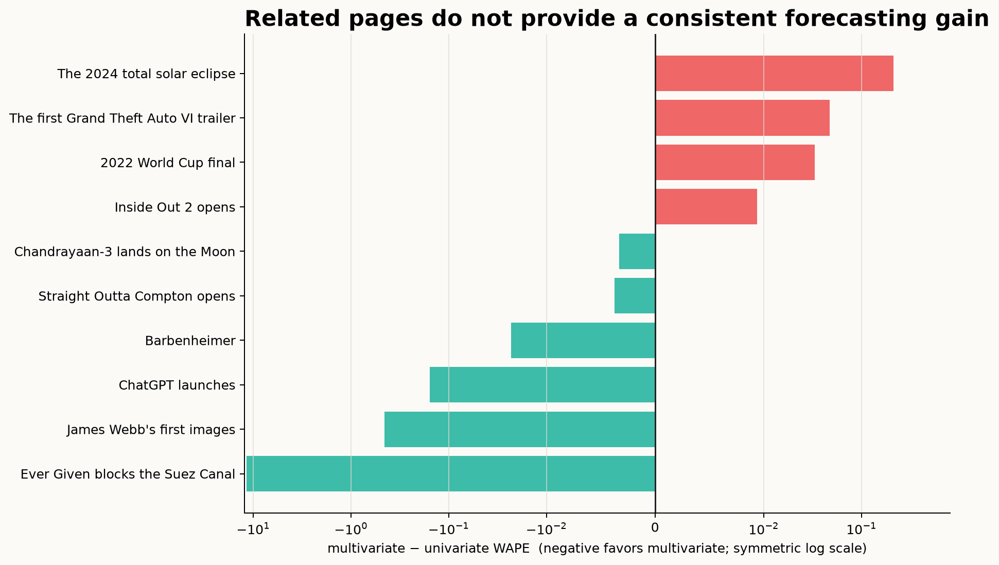
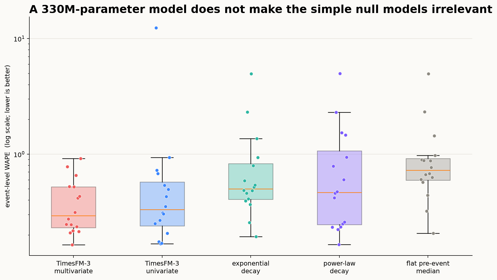
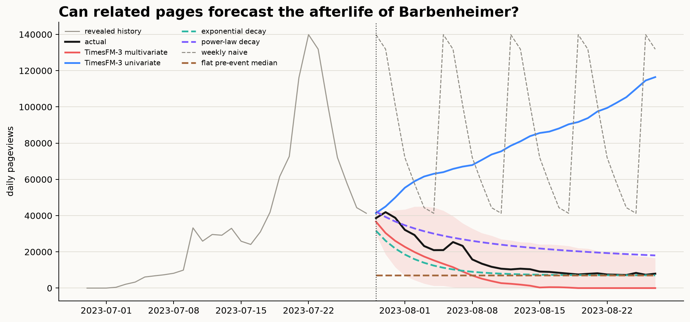
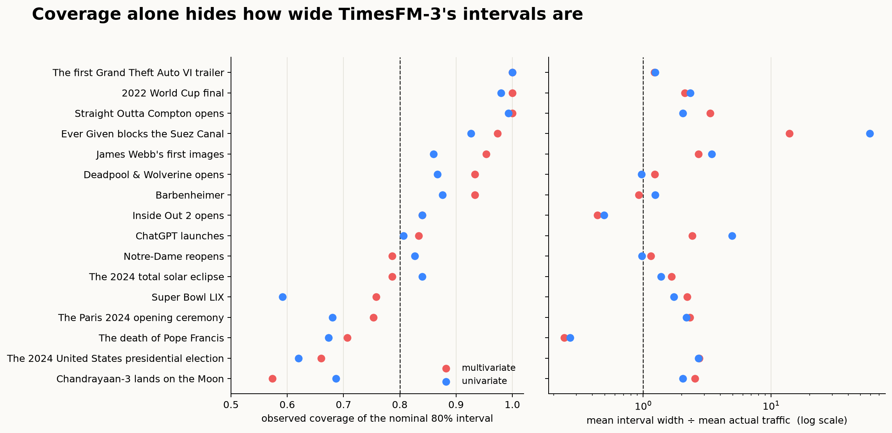

# Internet Half-Life

[](https://github.com/meryemsakin/internet-half-life/actions/workflows/ci.yml)
[](https://www.python.org/)
[](LICENSE)

**How many days does it take the internet to forget something?**

The first problem is deciding what "something" is. An internet event rarely
lives in one time series.

Internet Half-Life follows sixteen cultural events through constellations of
related English Wikipedia pages. Across this deliberately selected catalog,
the pages received **176.4 million views above their ordinary-day baselines**
in the first 60 days. For the median event, **53.2% of that excess sat outside
the page chosen to represent the event**. Traffic-weighted across the full
catalog, the share was 69.4%.

Those are properties of the constellations in this repository, not estimates
for the internet as a whole. The events and their four to six related pages
were chosen manually. Adding another related page can only increase the amount
of attention counted outside the primary page.

For Barbenheimer, the share was **97.8%**: most traffic in its chosen seven-page
constellation landed on the films, actors, J. Robert Oppenheimer, and the
Manhattan Project rather than on the portmanteau's own page.



The timing check changed the interpretation. Within the first fourteen days,
35 of 65 related pages peaked on the same day as the primary page, 19 peaked
before it, and only 11 after it. The data do not show attention flowing outward
from a primary page. They show an event appearing across several pages at once.



This repository makes that distributed attention visible, measures how its
parts fade, and then asks whether TimesFM-3 can forecast them together.

## What the atlas measures

Each event is a dated set of related pages: a primary event page plus people,
works, places, organizations, objects, and ideas. For every page, the project
calculates:

- **Ordinary-day traffic:** the median of the 28 days immediately before the
  event. A one-view floor avoids division by zero for newly created pages.
- **Peak lift:** peak traffic divided by ordinary-day traffic. Atlas timelines
  use a logarithmic scale so a new or previously dormant page does not flatten
  every other series.
- **Attention half-life:** the first day after the peak when excess traffic
  stays below half its peak excess for three consecutive days. This is an
  empirical threshold, not an assumption that attention decays exponentially.
- **Spillover:** the share of 60-day excess traffic outside the primary page.
- **Lead/lag co-movement:** the strongest timing relationships between pages.
  These edges are descriptive, never causal.
- **Peak timing:** the peak day of each related page minus the primary page's
  peak day, restricted to the first fourteen days after the event.



The catalog is small on purpose. Its sixteen events were hand-picked because
they produced visible attention shocks; it is an atlas of interesting cases,
not a representative sample of everything that happened online.

Two sensitivity checks bound the baseline choices. Raising the minimum
ordinary-day level from 1 to 5 or 10 views leaves both the median and
traffic-weighted outside-page shares unchanged to three decimals. Changing the
pre-event window from 14 to 28 to 56 days moves the median event share from
53.3% to 53.2% to 52.3%; the traffic-weighted share moves from 67.3% to 69.4%
to 70.0%. The share is stable, although the absolute amount of excess traffic
is not. Scheduled events can have promotion traffic inside any pre-event
window, so their excess totals should be read as baseline-dependent.

## The forecasting test

[TimesFM-3](https://www.research.google/blog/timesfm-3-a-zero-shot-foundation-model-for-multivariate-forecasting/)
is natively pretrained for multivariate forecasting. That makes the page
constellation part of the experiment rather than decoration:

> After observing the event day and the following seven days, do related pages
> help forecast the next 30 days?

Every event uses the same cutoff and is forecast six ways:

1. TimesFM-3 with all pages modeled jointly.
2. TimesFM-3 with each page modeled independently.
3. A two-parameter exponential decay fitted after the revealed peak.
4. A two-parameter power-law decay fitted after the revealed peak.
5. A zero-parameter forecast that returns immediately to the pre-event median.
6. A weekly seasonal-naive forecast.

The decay curves and flat forecast share the same fixed 28-day median baseline
used by the atlas. They are the relevant null models for fading attention. The
weekly naive remains only as a sanity check because repeating a spike week is a
deliberately weak opponent.

### What happened across all sixteen events

| model | median event WAPE ↓ |
|---|---:|
| TimesFM-3 multivariate | **0.294** |
| TimesFM-3 univariate | 0.332 |
| power-law decay | 0.467 |
| exponential decay | 0.502 |
| flat pre-event median | 0.725 |

The weekly naive scored 2.902 and is kept in the machine-readable results as a
sanity check, not displayed as a serious competitor.

WAPE here pools absolute error across every page and forecast day, then divides
by total actual traffic. Higher-traffic pages therefore carry more weight. A
second calculation takes the median page-level WAPE within each event; it
preserves the same practical conclusion, with a multivariate-minus-univariate
median difference of −0.006 instead of −0.008.

The median alone makes the multivariate model look convincing. The paired
event-level result does not. Multivariate TimesFM won ten events and lost six;
the median multivariate-minus-univariate difference was only **−0.008 WAPE**.
An exact two-sided sign test gives **p = 0.454**. With sixteen selected events,
the data still do not distinguish the multivariate gain from zero.

The *mean* difference is **−0.755**, which looks decisive and is not. It is one
event. On Ever Given, univariate TimesFM scored **12.43 WAPE** against **0.78**
for the multivariate run; every other event falls between −0.45 and +0.21.
Reporting the mean here would be reporting a single failure. The failure is
worth its own sentence, though, and it is not the one the mean implies:
multivariate context did not reliably improve accuracy, but on the one occasion
the univariate model came apart entirely, the joint model did not.



The simple baselines matter, too. In **six of sixteen events**, at least one of
the two parametric decay curves beat both TimesFM modes. On Straight Outta Compton,
for example, power-law decay scored **0.234 WAPE**, versus **0.248** for
multivariate TimesFM. A 330M-parameter foundation model can still lose to a
two-parameter description of the process being forecast.

The flat pre-event median beat both TimesFM modes on only **one of sixteen**
events and was never the best method overall. The forecast window is not solved
merely by predicting that the spike is already over.



Barbenheimer shows the opposite case: multivariate TimesFM scored **0.246**,
univariate TimesFM **0.269**, exponential decay **0.411**, and power-law decay
**0.475**.



## Coverage is not enough

TimesFM returns 10th–90th percentile intervals. A calibrated nominal 80%
interval should cover roughly 80% of observations over repeated cases. Across
the sixteen events, mean event-level coverage was **84.3%** for multivariate and
**81.7%** for univariate TimesFM. Some events reached 100%; Chandrayaan-3 fell
to 57.3% in the multivariate run.

High coverage was often purchased with broad bands. The median interval width
was **2.16 times mean actual traffic** for multivariate and **1.89 times** for
univariate forecasts. The maximum event-level ratio reached 59.2. Coverage is
therefore reported beside sharpness, not as a standalone success metric.
Point-only baselines have no interval and are left blank rather than assigned a
misleading zero.



The checked-in [event table](results/catalog-study.csv) and
[machine-readable summary](results/study-summary.json) contain the exact
results behind these figures.

## Was the model already told the answer?

TimesFM 3.0's model card lists its pretraining sources, and one line is
unusually specific:

> Wikipedia Pageviews, **cutoff Nov 2023**.

That is a boundary published by the people who trained the model, which makes
it a natural experiment rather than a guess. Seven catalog events happened
before that date and could be in the training corpus. Nine happened after and
cannot be.

Raw error cannot answer this on its own: the later events are also more recent,
and Wikipedia traffic has changed for reasons unrelated to any model. So the
comparison runs on the ratio of TimesFM's error to the lower-WAPE of the two
parametric decay baselines on the same event. This is an oracle-normalized,
exploratory comparison—not a causal test. A two-parameter curve has no training
corpus and cannot have memorized anything, so if an era is simply harder to
forecast, both should degrade and the ratio may be more stable than raw error.

| | events | median WAPE | TimesFM ÷ best decay fit |
|---|---:|---:|---:|
| before the cutoff | 7 | 0.248 | **0.737** |
| after the cutoff | 9 | 0.418 | **0.943** |

On events it may have seen, TimesFM beats a two-parameter decay curve by 26%.
On events it cannot have seen, the margin falls to 6%. That direction is
consistent with a temporal-exposure advantage, but it is also consistent with
event-type imbalance and distribution shift.

It is also not significant. An exact two-sided permutation test on the
difference of medians gives **p = 0.47**. Sixteen hand-picked events cannot
resolve an effect this size, and the post-cutoff group is only three years wide. This is a
direction, not a finding, and the honest summary is that the test was run and
came back underpowered. Enlarging the catalog on the post-cutoff side is the
cheapest way to make it answerable — each event is one entry in
`catalog/events.json`.

## Reproduce it

The atlas does not require model weights:

```bash
make setup
make sample
```

This renders the checked-in Straight Outta Compton sample without a network
request. To rebuild Barbenheimer or another event from Wikimedia:

```bash
.venv/bin/internet-half-life fetch --event barbenheimer
.venv/bin/internet-half-life analyze --event barbenheimer
.venv/bin/internet-half-life render --event barbenheimer
```

To reproduce the full forecasting study:

```bash
make setup-timesfm
.venv/bin/internet-half-life fetch --event all
.venv/bin/internet-half-life analyze --event all
.venv/bin/internet-half-life forecast --event all
.venv/bin/internet-half-life study
```

The first model run downloads the TimesFM-3 checkpoint. API responses and raw
page-level CSVs are cached locally. The public Pageviews API begins on 1 July
2015; the loader explicitly removes unavailable leading dates instead of
mistaking them for zero traffic.

## Add an event

```bash
internet-half-life list
```

The full sixteen-event catalog is in [`catalog/events.json`](catalog/events.json).
Add another event there; the analysis code does not need to change.

## Interpretation and licensing

Daily traffic comes from Wikimedia's public
[Pageviews API](https://doc.wikimedia.org/generated-data-platform/aqs/analytics-api/reference/page-views.html)
with recognized automated traffic excluded. Pageviews are not people,
approval, sentiment, or the whole internet. Search engines, news placement,
redirects, page creation dates, and editorial choices all affect the series.

TimesFM source code and weights do not share the same terms. The source
repository is Apache-2.0, while the TimesFM-3.0 checkpoint used here is under
Google's separate
[non-commercial, non-production license](https://huggingface.co/google/timesfm-3.0-pytorch/blob/main/LICENSE).
Review those terms before running or publishing model-derived work.

## Project layout

```text
catalog/events.json                    curated event universes
src/internet_half_life/wikimedia.py   cached Pageviews client
src/internet_half_life/metrics.py     half-life and spillover metrics
src/internet_half_life/forecasting.py TimesFM and decay baselines
src/internet_half_life/study.py       paired cross-event evaluation
src/internet_half_life/visualize.py   publication-ready figures
results/                              checked-in aggregate results
tests/                                deterministic unit tests
```

The interesting cases are often the ones that refuse to decay cleanly.
